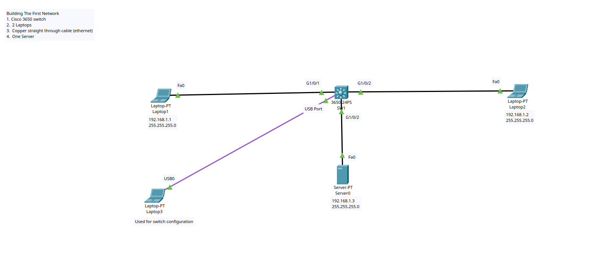

# Project: Basic Network Configuration

## Overview
This lab demonstrates basic network configuration in packet tracer, with a 3650 Switch, three laptops and a server

## Topology


## Technologies Used
- Ping
- DNS and Default Gateway Configuration
- MAC address and static ip address assigning

## Objectives
1. Establish connection between laptop 1 and 2
2. Establish connection between laptop 1 and 2 and Server
3. Observe packets as they move from one device to another
4. Ensure all end devices can ping the server
5. Establish connection to the switch through laptop 3

## Key Configurations

### Switch Configuration
```
Gig1/0/1
 Laptop 1
Gig1/0/2
 Laptop 2
Gig1/0/3
 Server
USB Port
 Laptop 3
```

## Verification
- All end devices can ping each other
- Switch is accessible through laptop 3
- Switch is learning the MAC addresses of all end devices

## Lessons Learned
- Ping to check connectivity
- Switch MAC Address table
- How packets travel across the network
