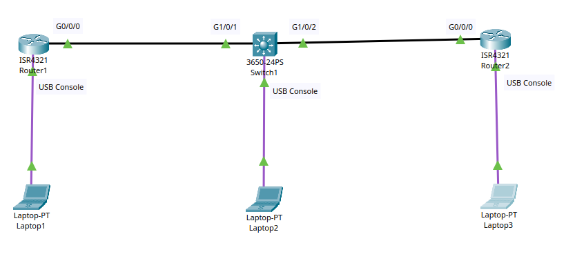

# Project: Simple Cisco Network

## Overview
This lab demonstrates building a simple Cisco network

## Topology

## Technologies Used
- USB cable for console connection
- ISR4321 Routers
- 3650-24 ports Switch
- Laptops

## Objectives
1. Establish connection from laptops to Switch and Routers via console connection using USB cable
2. Enter Switch configuration mode, rename the Switch and save the running configurations
3. Enter Routers Configuration mode, rename the routers, assign IP addresses and subnet masks to the connected gigabit ports, ensure the connected gigabit ports are up and save the running configs
4. Ensure Routers can ping each other with the traffic going through the 3650-24 ports Switch

## Verification
- Both routers can ping each other
- The Switch and both routers have been renamed
