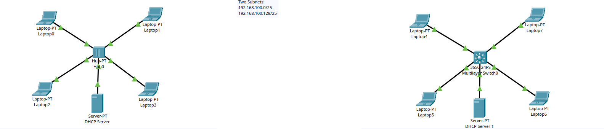

# Project: Simple Cisco Network

## Overview
This lab demonstrates Broadcast and Collision Domains

## Topology

## Objectives
Answer Below Questions:
1. When Laptop 0 pings Laptop 3, what type of packet is sent to the hub initially ?  - ARP
2. Who receives the ARP packets in step 1 ? All connected devices except Laptop 0
3. Who receives the return traffic from Laptop 3 ? All connected devices except Laptop 3
4. When ping traffic is sent from laptop 0 to Laptop 3 who receives it ? All connected devices except Laptop 0
5. How many broadcast and collision domains are in this network ? - Single broadcasts domain since traffic from one device is flooded to all ports and Single collision domains since if multiple devices transmit simultaneously, a collision occurs.
6. Assume the SWITCH MAC Address table is empty, when Laptop 4  pings Laptop 7 what type of packet is sent to the Switch initially ? - ARP
7. Who receives the ARP Packet ? -  All connected devices except Laptop 4
8. Who receives the return traffic from laptop 7 ? - The return traffic is received by laptop 4 only
9. When Ping traffic is sent from Laptop 4  to Laptop 7 who receives the traffic ? - Laptop 7 only
10. How many broadcast and collision domains are in this network ? - 5 broadcasts domains but  5 collision domain since a switch manages traffic based on the MAC addresses of the connected devices
