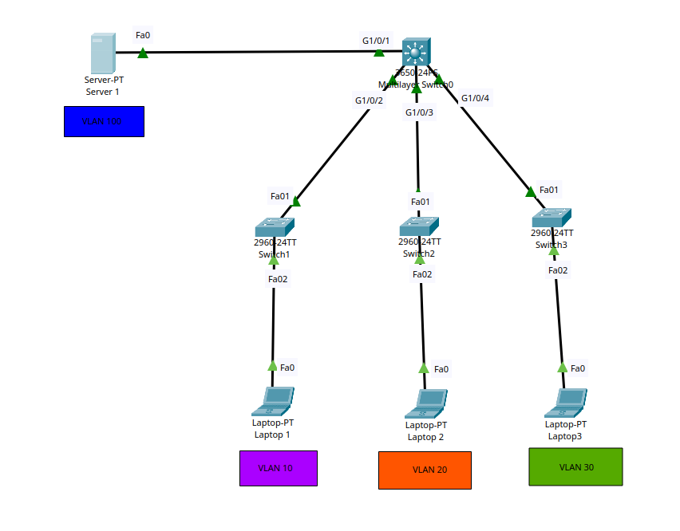

# Project: Simple Cisco Network

## Overview
This lab demonstrates VLANS

## Topology

## Objectives
1. SWITCH 3650-24PS layer three switch with IP addressing and InterVlan Routing: VLAN 1 = 10.1.1.254/24, VLAN 10 = 10.1.10.254/24, VLAN 20 = 10.1.20.254/24, VLAN 30 = 10.1.30.254/24, VLAN 100 = 10.1.100.254/24
2. Access Layer switches will only have management IP addresses in VLAN 1: SWITCH 1 = 10.1.1.1/24, SWITCH 2 = 10.1.1.2/24, SWITCH 3 = 10.1.1.3/24
3. Configure access ports as follows: PC1 in VLAN 10 - 10.1.10.10/24, PC2 in VLAN 20 - 10.1.20.20/24, PC3 in VLAN 30 - 10.1.30.30/24, Server1 in VLAN 100- 10.1.100.100/24
4. Configure ports between switches as Trunks - 802.1q protocol
5. Make sure that PCs can ping each other and the can ping the server too
6. Make sure the switches can ping the PCs and the server

