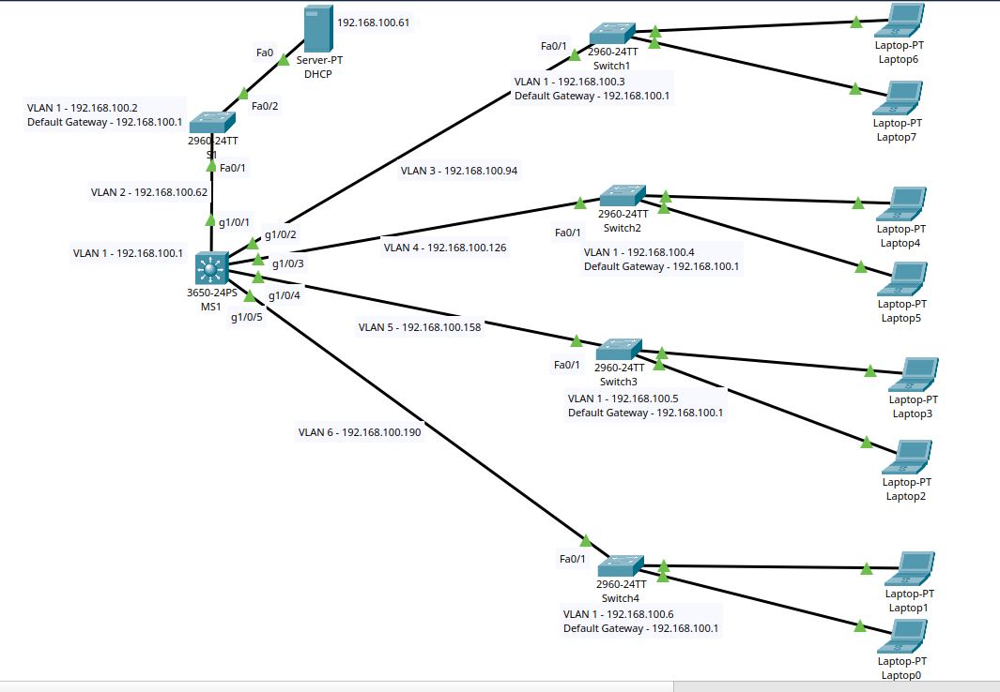

# Project: Simple Cisco Network

## Overview
This lab demonstrates VLANS

## Topology

## Objectives
1. Main Network 192.168.100.0/24

2. Create 8 Networks they will be /27 mask or 255.255.255.224: 
192.168.100.0, 
192.168.100.32, 
192.168.100.64, 
192.168.100.96, 
192.168.100.128,
192.168.100.160, 
192.168.100.192, 
192.168.100.224

3. 192.168.100.0 - Subnet for all management interfaces in the SWITCHES (VLAN 1 in all SWITCHES)

4. 192.168.100.32 - Used by VLAN 2 forDHCP server

5. 192.168.100.64 - Egineering - VLAN 3

6. 192.168.100.96 - Finance - VLAN 4

7. 192.168.100.128 - Customer service - VLAN 5

8. 192.168.100.160 - Legal - VLAN 6
